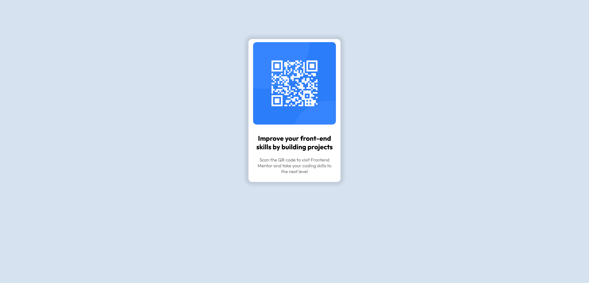

# Frontend Mentor - QR code component solution

This is a solution to the [QR code component challenge on Frontend Mentor](https://www.frontendmentor.io/challenges/qr-code-component-iux_sIO_H). Frontend Mentor challenges help you improve your coding skills by building realistic projects.

## Overview

- In this project i used auto margin to center card and styles that you provide me in style-guide.md

### Screenshot

### Links

- GitHub URL: [Here is my github project URL](https://github.com/Hrvoje1307/qr-code-card-design.git)
- Live Site URL: [Netlify site URL](https://qr-code-card-hrvoje.netlify.app/)

## My process

- First I looked what I have and I organized everything
- I wrote my HTML
- Then I center everything
- And make design like I saw on photos

### Built with

- HTML5
- CSS3
- CSS flexbox

### What I learned

I practiced my css flex and I practice some fundamentals of html and css that I've learned

### Continued development

Now I would like to practice more my HTML and CSS skills and I would like to move on anoter level and learn JavaScript

### Useful resources

- [For colors](https://yeun.github.io/open-color/#indigo) - This is a cool site for colors
- [For fonts](https://fonts.google.com/specimen/Outfit) - This is site where I choosed my fonts for this project

## Author

- Website - in progress
- Frontend Mentor - [@Hrvoje1307](https://www.frontendmentor.io/profile/Hrvoje1307)
- Twitter - [@cuckovichrs](https://twitter.com/cuckovichrs)

## Acknowledgments

I made this alone but I learned a lot from Jonas Schmedtmann
